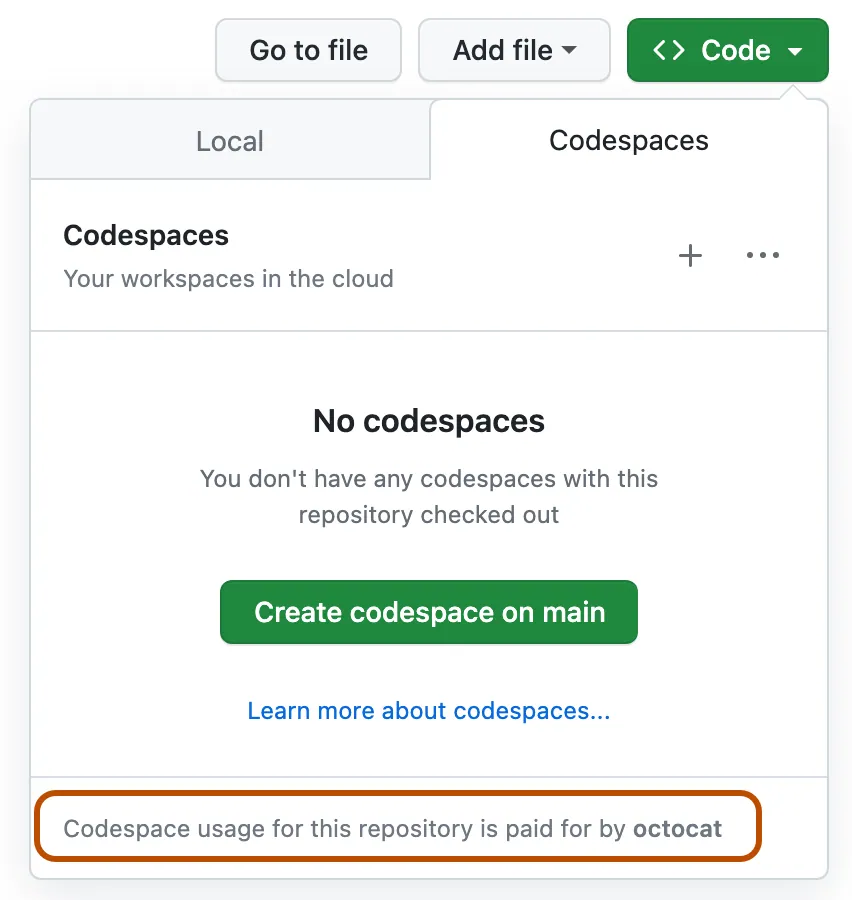

In order to run these code samples you MUST have the following:

Access to the Azure OpenAI Service OR OpenAI API - required
Basic knowledge of Python or TypeScript is helpful - *For absolute beginners check out these Python and TypeScript courses.
A GitHub account to fork this entire repo to your own GitHub account
I have developed a codespaces environmet to help you with setting up your development environment.

Don't forget to star (🌟) this repo to find it easier later.
# Getting Started with this course

We are very excited for you to start this course and see what you get inspired to build with Generative AI!

To ensure your success, this page outlines setup steps, technical requirements, and where to get help if needed.

## Setup Steps

To start taking this course, you will need to complete the following steps.

### 1. Fork this Repo

[Fork this entire repo](https://github.dev/leestott/AzureOpenAISamples) to your own GitHub account to be able to change any code and complete the challenges. You can also [star (🌟) this repo](https://docs.github.com/en/get-started/exploring-projects-on-github/saving-repositories-with-stars?WT.mc_id=academic-105485-koreyst) to find it and related repos easier.

### 2. Create a codespace

To avoid any dependency issues when running the code, we recommend running this course in a [GitHub Codespaces](https://github.com/features/codespaces).

This can be created by selecting the `Code` option on your forked version of this repo and selecting the **Codespaces** option.



### 3. Storing Your API Keys

Keeping your API keys safe and secure is important when building any type of application. We recommend not to store any API keys directly in your code. Committing those details to a public repository could result in security issues and even unwanted costs if used by a bad actor.

# IMPORTANT!
## Setup environment variables
- Duplicate the `.env.template` file and rename the new file to `.env`.
- Open your new `.env` file and modify all the endpoints and api keys for all deployments as follows:
```
# Open AI details
OPENAI_GPT35_DEPLOYMENT_NAME="gpt-35-turbo-16k"
OPENAI_GPT4_DEPLOYMENT_NAME="gpt-4"
OPENAI_GPT4V_DEPLOYMENT_NAME="gpt-v"
OPENAI_ADA_EMBEDDING_DEPLOYMENT_NAME="text-embedding-ada-002"
OPENAI_DALLE_DEPLOYMENT_NAME="dall-e-3"

OPENAI_DEPLOYMENT_ENDPOINT="<your azure openai deployment url>" 
OPENAI_API_KEY="<the key to the azure open ai service>"

GPT4o_DEPLOYMENT_NAME="<your gpt-4o deployment name>"
GPT4o_DEPLOYMENT_ENDPOINT="<your azure openai deployment url>"
GPT4o_API_KEY="<the key to the azure open ai service>"

# SQL Server details
SQL_USER="SqlAdmin"
SQL_DBNAME="aworks"

SQL_SERVER="<your sql server url>"
SQL_PWD="<the password you defined in the bicep file>"


# AI Speech details
SPEECH_REGION="westeurope"

SPEECH_KEY="<the key for the ai speech service>"

# AI Vision details
VISION_REGION="swedencentral"

AZURE_COMPUTER_VISION_ENDPOINT="<azure ai vision deployment url>"
AZURE_COMPUTER_VISION_KEY="<the key to the ai vision service>"

# AI Search details
AZURE_SEARCH_SERVICE_ENDPOINT="<your azure ai search deployment url>"
AZURE_SEARCH_ADMIN_KEY="<the management key of the ai search>"
```

## How to Run locally on your computer

To run the code locally on your computer, you would need to have some version of [Python installed](https://www.python.org/downloads).

To then use the repository, you need to clone it:

```shell
git clone https://github.dev/leestott/AzureOpenAISamples
cd generative-ai-for-beginners
```

Once you have everything checked out, you can get started!

### Installing Miniconda (optional step)
[Miniconda](https://conda.io/en/latest/miniconda.html) is a lightweight installer for installing [Conda](https://docs.conda.io/en/latest), Python, as well as a few packages.
Conda itself is a package manager, that makes it easy to setup and switch between different Python [**virtual environments**](https://docs.python.org/3/tutorial/venv.html) and packages. It also comes in handy for installing packages that are not available via `pip`.

You can follow the [MiniConda installation guide](https://docs.anaconda.com/free/miniconda/#quick-command-line-install) to set it up.

With Miniconda installed, you need to clone the [repository](https://github.dev/leestott/AzureOpenAISamples) (if you haven't already)

Next, you need to create a virtual environment. To do this with Conda, go ahead and create a new environment file (_environment.yml_). If you are following along using Codespaces, create this within the `.devcontainer` directory, thus `.devcontainer/environment.yml`.

Go ahead and populate your environment file with the snippet below:
```yml
name: <environment-name>
channels:
 - defaults
dependencies:
- python=<python-version>
- openai
- python-dotenv
```

The environment file specifies the dependencies we need. `<environment-name>` refers to the name you would like to use for your Conda environment, and `<python-version>` is the version of Python you would like to use, for example, `3` is the latest major version of Python.

With that done, you can  go ahead and create your Conda environment by running the commands below in your command line/terminal


```bash
conda env create --name ai4beg --file .devcontainer/environment.yml # .devcontainer sub path applies to only Codespace setups
conda activate ai4beg
```

Refer to the [Conda environments guide](https://docs.conda.io/projects/conda/en/latest/user-guide/tasks/manage-environments.html) if you run into any issues.

### Using Visual Studio Code with the Python support extension

We recommend using the [Visual Studio Code (VS Code)](http://code.visualstudio.com/) editor with the [Python support extension](https://marketplace.visualstudio.com/items?itemName=ms-python.python) installed for this course. This is, however, more of a recommendation and not a definite requirement

> **Note**: By opening the course repository in VS Code, you have the option to set the project up within a container. This is because of the [special `.devcontainer`](https://code.visualstudio.com/docs/devcontainers/containers) directory found within the course repository. More on this later.

> **Note**: Once you clone and open the directory in VS Code, it will automatically suggest you install a Python support extension.

> **Note**: If VS Code suggests you re-open the repository in a container, decline this request in other to use the locally installed version of Python. 

### Using Jupyter in the Browser

You can also work on the project using the [Jupyter environment](https://jupyter.org) right within your browser. Both classic Jupyter and [Jupyter Hub](https://jupyter.org/hub provide quite a pleasant development environment with features such as auto-completion, code highlighting, etc.

To start Jupyter locally, head over to the terminal/command line, navigate to the course directory, and execute:

```bash
jupyter notebook
```

or

```bash
jupyterhub
```

This will start a Jupyter instance and the URL to access it will be shown within the command line window.

Once you access the URL, you should see the course outline and be able to navigate to any `*.ipynb` file. For example, `08-building-search-applications/python/oai-solution.ipynb`.

### Running in a container

An alternative to setting everything up on your computer or Codespace is to use a [container](https://en.wikipedia.org/wiki/Containerization_(computing). The special `.devcontainer` folder within the course repository makes it possible for VS Code to set up the project within a container. Outside of Codespaces, this will require the installation of Docker, and quite frankly, it involves a bit of work, so we recommend this only to those with experience working with containers.

One of the best ways to keep your API keys secure when using GitHub Codespaces is by using Codespace Secrets. Please follow the [Codespaces secrets management](https://docs.github.com/en/codespaces/managing-your-codespaces/managing-secrets-for-your-codespaces) guide to learn more about this.

## Using the Azure OpenAI Service for the first time

If this is your first time working with the Azure OpenAI service, please follow this guide on how to [create and deploy an Azure OpenAI Service resource.](https://learn.microsoft.com/azure/ai-services/openai/how-to/create-resource?pivots=web-portal)

## Using the OpenAI API for the first time

If this is your first time working with the OpenAI API, please follow the guide on how to [create and use the Interface.](https://platform.openai.com/docs/quickstart?context=python)

## Meet Other Learners

We have our official [AI Community Discord server](https://aka.ms/genai-discord) for meeting other learners. This is a great way to network with other like-minded entrepreneurs, builders, students, and anyone looking to level up in Generative AI.

[](https://aka.ms/genai-discord)

The project team will also be on this Discord server to help any learners.


# Requirements
- Visual Studio Code
- Python (tested with 3.10, 3.12)
- Python virtual environment tool (venv)
- An Azure account 
- Azure subscription onboarded into Azure OpenAI
- Necessary permissions to deploy resources in the subscription

# Preparation

## Git repository
- Clone this repository to your local machine and open a terminal in the cloned directory.

## Visual Studio Code
- Windows
    - Install [Visual Studio Code](https://code.visualstudio.com/)
- Linux
    - Install [Visual Studio Code](https://code.visualstudio.com/)
- Mac
    - Install [Visual Studio Code](https://code.visualstudio.com/)

## Python
- Windows
    - Install [Python 3.12.2](https://www.python.org/downloads/release/python-3122/)
- Linux
    - It is usually pre-installed. Check version with `python3 --version`.
- Mac
    - `brew install python3`

### Python Virtual Environment Setup
-  To install virtualenv via pip run:
    - Windows / Mac / Linux:

         `pip3 install virtualenv`

- Creation of virtualenv (in the cloned Azure/AOAI-workshop directory):
    - Windows:

        `python -m virtualenv venv`
    - Mac / Linux:

        `virtualenv -p python3 venv`

- Activate the virtualenv:
    - Windows:

        `.\venv\Scripts\activate.ps1`
    - Mac / Linux

        `source ./venv/bin/activate`

### Install required libraries in your virtual environment
- Run the following command in the terminal:
    - Windows / Mac / Linux:

        `pip3 install -r requirements.txt`


